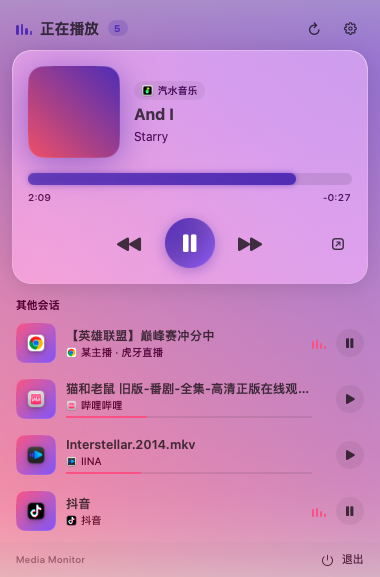
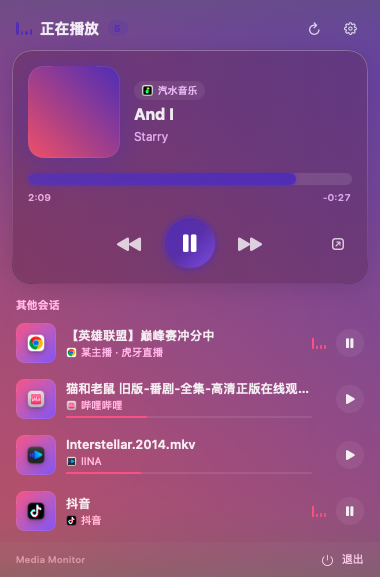
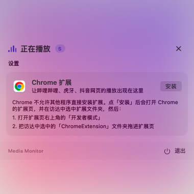

# Media Monitor

English · [中文](README.md)

A macOS menu bar app that gathers the music, videos and live streams you are playing into one panel, so you can see what's playing and how far along it is, and pause or resume it without switching apps.

<p>
  
  
</p>

## Supported players

| Source | What is shown | What you can do |
| --- | --- | --- |
| Soda Music (汽水音乐) | Title, artist, artwork, progress | Play/pause, previous/next, seek |
| Bilibili, LX Music, IINA (desktop apps) | Title and progress from the system Now Playing feed | Play/pause, seek, etc. (depends on the app) |
| Douyin (抖音, desktop app) | Whether it is playing | Play/pause |
| Huya Live (虎牙直播, desktop app) | Room title, streamer, whether it is making sound | Clicking brings the app forward (it does not accept outside control) |
| Audio and video on any web page in Chrome | Title, site, progress, live status | Play/pause, seek, skip ±10 s, switch to the tab; previous/next on YouTube, Bilibili, NetEase Cloud Music, QQ Music, Spotify and SoundCloud |

When several sources play at once, the one that started most recently is shown at the top and the rest are listed under "其他会话" (other sessions).

The interface is in Chinese.

## Requirements

- macOS 14.2 or later on Apple silicon
- Xcode Command Line Tools to build from source (`xcode-select --install`); the full Xcode is not needed
- Google Chrome for web players

## Install

```bash
git clone https://github.com/YorenZZZ/media-monitor.git
cd media-monitor
./build.sh --install
```

`build.sh` builds the app into `outputs/Media Monitor.app`; with `--install` it also copies it to /Applications and launches it. An icon appears in the menu bar; click it to open the panel.

### Permissions asked on first use

- **Accessibility**: needed to read and control Soda Music and to read the Huya room title. A banner appears at the top of the panel; click "去授权" and turn on Media Monitor in System Settings › Privacy & Security › Accessibility.
- **System audio recording**: only used to tell whether the Huya Live app is currently making sound. No audio is recorded or saved.
- **Automation**: macOS may ask once when a player is controlled; choose Allow.

## Installing the Chrome extension (web players)

Chrome does not let other programs install extensions, so the last step is yours:

1. Click the menu bar icon, then the gear in the top-right corner to open Settings (设置).
2. In the "Chrome 扩展" row, click **安装** (Install).
   - If Chrome is not found, it tells you to install the browser first.
   - Otherwise it opens Chrome's extensions page (`chrome://extensions`) and selects the extension folder in Finder.
3. Turn on **Developer mode** in the top-right corner of the extensions page.
4. Drag the `ChromeExtension` folder selected in Finder onto the extensions page.

After a few seconds Settings shows "Chrome 扩展已安装" (extension installed). Tabs that are already open are picked up without reloading.



The extension files live in `~/Library/Application Support/Media Monitor/ChromeExtension`. When you update the app, they are refreshed automatically and Chrome uses the new version after it restarts.

## Privacy

- Everything stays on your Mac and nothing is uploaded. The only network request is downloading cover art when a player gives it as a web URL.
- The Chrome extension asks for access to all sites so that media on any page is picked up. It only reads the state of the page's audio and video elements, and sends only the page title, site hostname, duration, current position and playing state to the local Media Monitor app over Chrome native messaging. It reads nothing else on the page.
- Huya Live's audio is only used to measure its current loudness. It is never recorded or saved.

## Uninstall

1. Quit Media Monitor ("退出" in the bottom-right corner of the panel) and move it from /Applications to the Trash.
2. Remove "Media Monitor Browser Bridge" at `chrome://extensions`.
3. Optionally delete `~/Library/Application Support/Media Monitor` and `~/Library/Application Support/Google/Chrome/NativeMessagingHosts/io.github.yorenzzz.media_monitor.json`.

## Project layout

| Path | Contents |
| --- | --- |
| `Sources/` | The app (Swift / SwiftUI) |
| `Helper/NowPlayingHelper.m` | Helper library that reads the system Now Playing feed |
| `ChromeExtension/` | Chrome extension, bundled into the app at build time |
| `Tools/` | Generates the app icon during the build |
| `build.sh` | Build script |

## License

[MIT](LICENSE)
